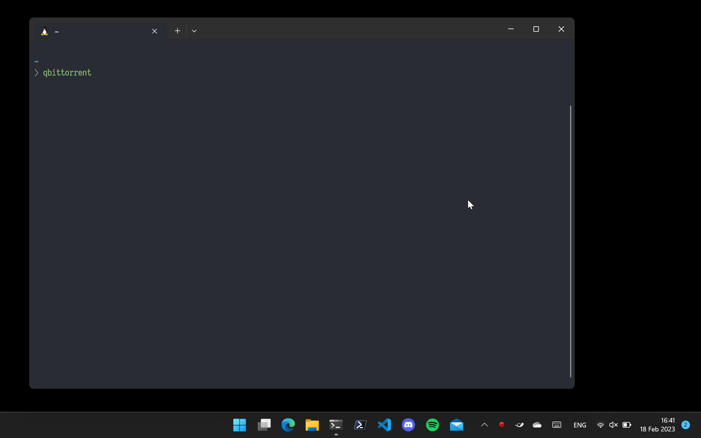

# Wormhole

Wormhole is an experimental implementation of several D-Bus interfaces using Win32 / WinRT.
The goal of Wormhole is to enable Linux apps running in the Windows Subsystem for Linux to integrate better with the Windows Desktop environment.

## Demo



## Usage

### D-Bus

D-Bus must be running in WSL.
D-Bus can either be started using systemd, or by using the provided `session-manager` program.

Add the following to your `~/.profile` to run the session-manager and set the correct environment variables:

```shell
dbus_vars=$(wsl-session-mgr 2>&1)
if [ $? -ne 0 ]; then
    echo "$dbus_vars"
else
    eval $dbus_vars
fi
```

### Starting Wormhole

The Wormhole `bridge` program must be started before the `backend`.
The bridge runs in WSL and provides D-Bus access to the `backend`.

The `backend` must be started with Administrator privileges in Windows.

## Patching zbus

Wormhole needs a patched version of zbus in order to function:

1. Download [zbus v2.1.0](https://gitlab.freedesktop.org/dbus/zbus/-/releases/zbus-2.1.0)
1. Extract to `../zbus` (relative to Wormhole directory)
1. Apply patches:

```shell
cd ../zbus
git apply ../Wormhole/zbus_patches/non-native-endian.patch
git apply ../Wormhole/zbus_patches/wsl.patch
```
